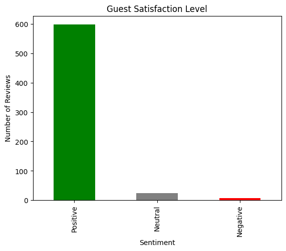

# Airbnb Data Analytics

Data analysis project for **Airbnb Cairo rentals**. The repository explores rental features, ratings, review sentiment, and pricing to better understand guest experience,  market behavior and optimize rental pricing strategies.

## Project Overview
This project contains notebooks and scripts that:
- Load and explore Airbnb rentals and reviews datasets.
- Perform **NLP / sentiment analysis** on guest reviews.
- Generate charts and heatmaps to visualize sentiment, pricing, and feature distributions.

## Repository Structure
- `Data/` — datasets used in the analysis (raw/cleaned).
- `Scrapper/` — Using **selenium** to extract rental features and user reviews.
- `Cleaning/` — cleaning scrabbed data (e.g., handling nulls, filtering columns, handling datatypes)
- `nlp/` — NLP notebooks (e.g., features extraction from, review analysis).
- `Analysis/` — Prices analysis with location, ratings and rental features.
- `Models/` — Regression model for predicting price based on rental features.

## Reviews Sentiment Analysis (NLP)
The notebook `nlp/Reviews_Analysis.ipynb` performs:
- Loading the reviews dataset.
- Computing sentiment scores (e.g., using TextBlob polarity).
- Classifying reviews into **Positive / Neutral / Negative**.
- Plotting the distribution of sentiment.

### Output 
Below is the sentiment distribution chart generated in the notebook:




## How to Run
1. Clone the repository:
   ```bash
   git clone https://github.com/Mennaa-Ayman/Airbnb-Data-Analytics.git
   cd Airbnb-Data-Analytics
   ```
2. (Recommended) Create and activate a virtual environment.
3. Install dependencies:
   ```bash
   pip install -r requirements.txt
   ```
4. Open and run notebooks:
   ```bash
   jupyter notebook
   ```

## Notes
- File paths in notebooks may assume a specific folder layout. Adjust paths if your data is stored elsewhere.
- Some notebooks may have been authored in Google Colab; local execution may require small path changes.
